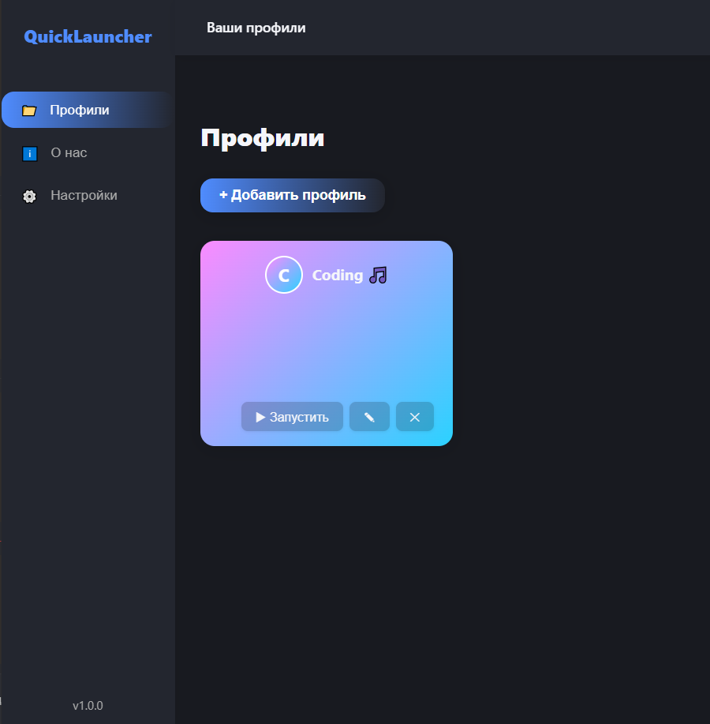
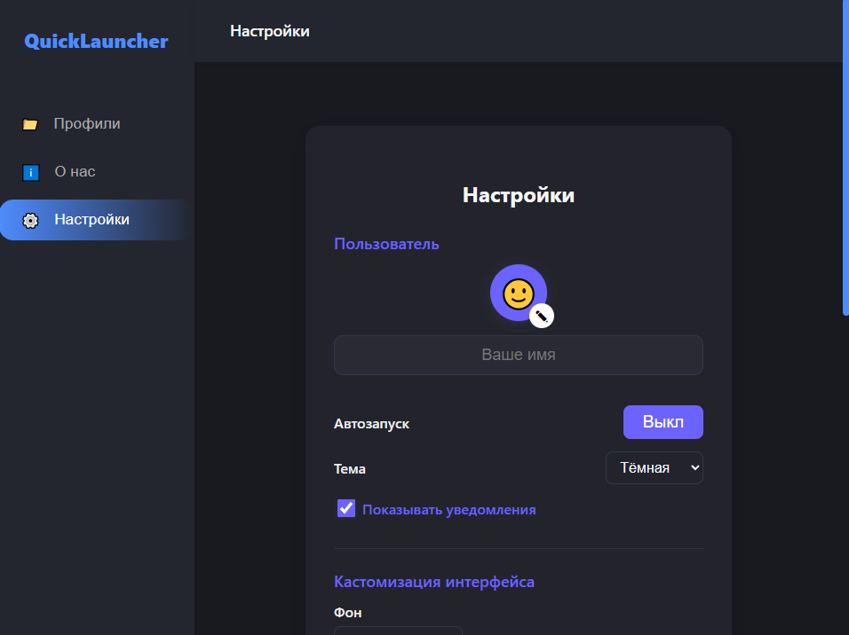
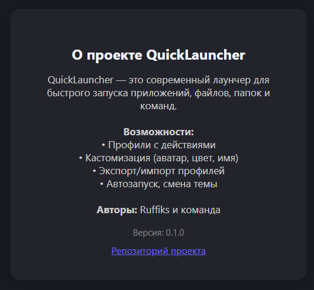

# 🚀 QuickLauncher

[](https://github.com/WaveHex/QuickLauncher "Go to GitHub repo")
[](https://github.com/WaveHex/QuickLauncher)
[](https://github.com/WaveHex/QuickLauncher)
[](https://github.com/WaveHex/QuickLauncher/releases/)
[](#license)


**QuickLauncher** — это современное приложение для мгновенного запуска программ, файлов и команд на Windows. Минимализм, кастомизация, удобство и скорость — всё, что нужно для продуктивной работы!

[🌐 Открыть лендинг](https://WaveHex.github.io/quicklauncher/landing.html)

---

## ✨ Возможности

- ⚡ **Мгновенный запуск** приложений, файлов и команд
- 🎨 **Кастомизация**: фон, шрифты, цвета, темы
- 🔔 **Уведомления**: toast и системные (Tauri)
- 🛡️ **Безопасность**: работает локально, не требует интернета
- 🖱️ **Системный трей**: быстрый доступ к функциям
- 💾 **Импорт/экспорт** профилей
- 🖼️ **Галерея**: предпросмотр профиля и настроек

---

## 🖼️ Скриншоты

| Главный экран | Настройки | О нас |
|:---:|:---:|:---:|
|  |  |  |

---

## 🚩 Как начать

1. **Скачать** последнюю версию: [GitHub Releases](https://github.com/WaveHex/quicklauncher/releases/latest)
2. **Установить** и запустить приложение
3. **Создать профиль** и добавить свои приложения/файлы
4. **Пользоваться быстрым поиском и запуском!**

---

## 🛠️ Разработка

```bash
# Установить зависимости
npm install

# Запустить dev-режим (основное приложение)
npm run tauri dev

# Запустить лендинг (открой http://localhost:5173/landing.html)
npm run dev

# Production-сборка (app + landing)
npm run build
npm run tauri build
```

---


## 📦 Технологии
- [React](https://react.dev/)
- [Vite](https://vitejs.dev/)
- [Tauri](https://tauri.app/)
- [Lucide React](https://lucide.dev/)

---

## 📄 Лицензия

Released under [CC BY-SA 4.0](/LICENSE) by [@WaveHex](https://github.com/WaveHex).

---

## 🤝 Обратная связь и вклад

- [Открыть issue](https://github.com/yourusername/quicklauncher/issues)
- [Создать pull request](https://github.com/yourusername/quicklauncher/pulls)

---


**QuickLauncher** — твой быстрый старт каждый день!
